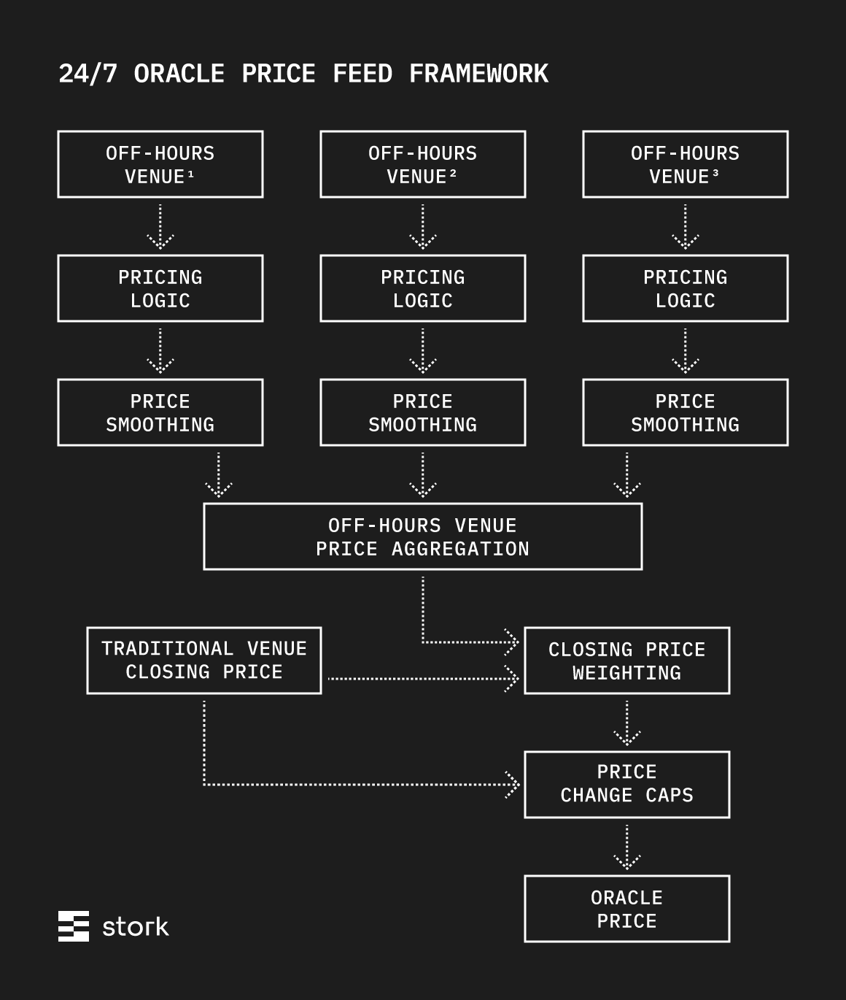

# 24/7 Price Feeds

Traditional markets for assets underlying RWA perps open and close on various set schedules. For example, metals and energy commodities are open 23 hours weekdays (closed 5pm-6pm), starting Sunday night at 6pm and ending Friday night at 5pm (excluding holidays).

A single price feed can be constructed by relying primarily on traditional venues during open hours and using some combination of traditional venue closing prices and various non-traditional venues during off hours. Constructing this feed is an opinionated process that changes with use case, risk profile, and other factors. Stork has investigated the pricing algorithms of the major RWA perp exchanges and offers a modular methodology, which can be customized to each user.

## Framework

When traditional markets are closed, Stork's 24/7 oracles do a cutover to a Perpetual Swap Oracle Price Feed. This feed is computed by:

1. Calculating an order book price based on impact prices for multiple constituent perpetual markets.
2. Applying an exponential moving average for flash manipulation resistance (smoothing).
3. Taking a median of the smoothed feeds (venue-level manipulation resistance).
4. Weighting order book impact price divergence vs. the traditional venue close.
5. Applying a cap function on top of the final adjusted price, limiting drift from the traditional market close.

<figure><figcaption></figcaption></figure>

The oracle listens to multiple constituent venues, calculating an Impact Bid and Impact Ask price for each, and updating a Venue Price for each market, whenever the Impact Bid and Ask differ materially from the current Venue Price.

For each constituent market, the update logic looks like this:

* On the very first deploy, compute the Impact Bid and Impact Ask prices for the configured impact size. Set the initial Venue Price to:

$$Venue_{0} = (ImpactBid_{0} + ImpactAsk_{0}) / 2$$

* Each time the order book changes, update the Venue Price based on the updated Impact Bid and Impact Ask prices as well as the last Venue Price:
  * $$\text{if } ImpactBid_{i} > Venue_{i-1} \text{ then } Venue_{i} = ImpactBid_{i}$$
  * $$\text{else if } ImpactAsk_{i} < Venue_{i-1} \text{ then } Venue_{i} = ImpactAsk_{i}$$
  * $$\text{else } Venue_{i} = Venue_{i-1}$$

This process runs 24/7: even when traditional markets are open and Stork is not reporting the perp Venue Prices, perp Venue Prices will update continuously in the background to ensure a previous Venue Price is always available.

Whenever traditional markets are open, each Stork 24/7 feed bypasses these steps, sourcing data directly from traditional markets.

## Off-Hours Venue Selection

For the most liquid markets, Stork Oracle Price data is primarily sourced from a subset of five constituent venues: Binance, Bitget, Hyperliquid, Lighter, and OKX. Other 24/7 RWA perpetual market data is monitored.

Stork also supports integrating with subscriber exchanges' own order books as a source. Custom venue selection is available for exchanges setting up perps on more thinly traded underlying assets.

## Responsiveness

Stork's 24/7 Perpetual Swap Oracle Price Feeds are configurable to be more or less responsive or restrictive, relative to live order book data. Too responsive, and prices may be vulnerable to manipulation on underlying markets. Too restrictive, and prices may ignore market-moving events. Either extreme can contribute to unexpected liquidations.

The following parameters control Oracle Price responsiveness to changes in the constituent order books.

1. Impact Size ($N$): a manipulation-resistant alternative to the midpoint price, the live order book Impact Price $P_{Impact}$ is equal to the price at which a given notional size $N$ can be executed in the existing order book. A lower $N$ heightens the oracle's responsiveness to order book activity.

$$P_{impactBid}(N) = \frac{N}{Q_{bid}(N)}$$

$$P_{impactAsk}(N) = \frac{N}{Q_{ask}(N)}$$

2.  EMA Window ($\tau$): The oracle applies a time-decay EMA with a configured time constant $\tau$ on top of each live order book Impact Price from constituent markets.

    a. On the very first deploy, this value is initialized to the starting Venue Price:

    $$ImpactEMA_{0} = Venue_{0}$$

    b. Any time the live order book Impact Price changes after the very first deploy, update the EMA with a decay based on the difference between the time of this update and the time of the previous impact venue change:

    $$\alpha = e^{-(t_{i} - t_{i-1})/\tau}$$

    $$VenueEMA_{i} = \alpha \cdot VenueEMA_{i-1} + (1 - \alpha) \cdot Venue_{i}$$

    Shorter windows are more responsive to order book activity; an EMA over any time window improves the price's resistance to manipulation on the underlying market.
3.  Traditional Venue Price Weight ($W$): A more restrictive oracle sets a greater Traditional Venue Price $P_{trad}$ weight $W$, muting Oracle Price $P_{oracle}$ responsiveness to the off-hours Venue Price $P_{off\text{-}hours}$.

    $$P_{oracle} = W \cdot P_{trad} + (1 - W) \cdot P_{off\text{-}hours}$$
4. Deviation Cap ($C$): a maximum percent change versus the traditional market close price limits the potential damage of manipulation in underlying markets. The Oracle Price will go flat once it moves more than $C$ basis points higher or lower than the traditional market close. Deviation Cap can be set fairly large as a backstop against extreme cases; if real world events occur which cause true large price changes, caps may unfairly increase funding for smart traders.

## A Note on Customization

This modular methodology is built to allow opinionated construction of Oracle Price feeds for various use cases and risk appetites. It is not intended to define a single price for any specific asset. Parameters defined here can be set by each subscriber, based on these considerations.
